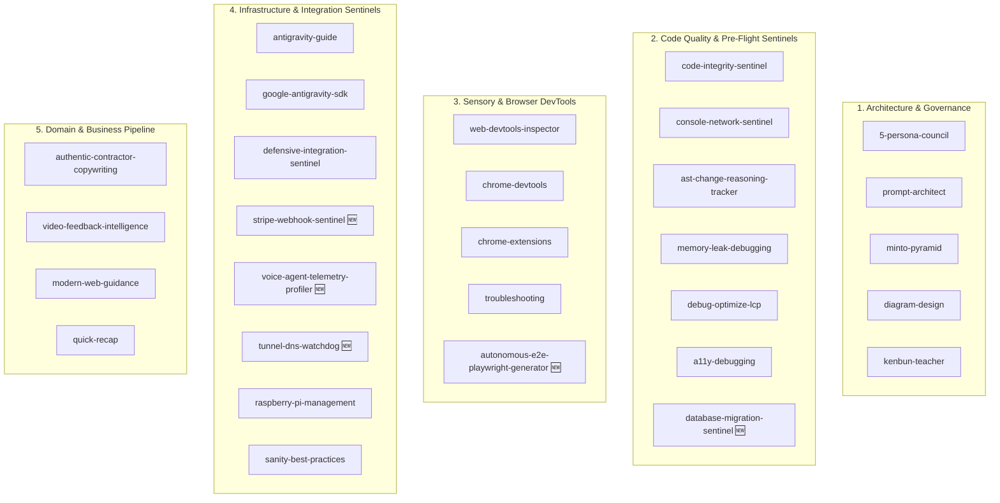

# 🏛️ Kenbun Master Skills Registry & Scope Matrix

This document is the sovereign catalog of all 38 specialized agent skills registered within the Kenbun ecosystem (`.agents/skills/`). Each skill extends the Swarm's autonomous reasoning, defensive engineering, and real-time execution capabilities.

---

## 🌌 Domain Architecture Overview

---

## 📦 Complete Inventory of All 38 Skills

| # | Skill Identifier | Primary Mission / Activation Trigger | Key Tools & References |
|---|---|---|---|
| 1 | [`5-persona-council`](.agents/skills/5-persona-council/SKILL.md) | Multi-perspective strategic consensus (CyberGuard, ScaleMaster, FrugalCFO, PixelArchitect, FutureSelf). | `consult_supervisor`, System 2 Audit |
| 2 | [`a11y-debugging`](.agents/skills/a11y-debugging/SKILL.md) | Accessibility (a11y), ARIA, tap targets, contrast auditing. | Chrome DevTools, accessibility tree |
| 3 | [`antigravity-guide`](.agents/skills/antigravity-guide/SKILL.md) | Guide for AGY CLI, IDE, SDK, slash commands, and remote control. | [`references/remote_control.md`](.agents/skills/antigravity-guide/references/remote_control.md) |
| 4 | [`ast-change-reasoning-tracker`](.agents/skills/ast-change-reasoning-tracker/SKILL.md) | AST diff analysis, symbol modifications, and board telemetry. | `track_ast_changes`, Planka Sync |
| 5 | [`authentic-contractor-copywriting`](.agents/skills/authentic-contractor-copywriting/SKILL.md) | Authentic residential/commercial contractor trade copywriting. | Tradesman tone guidelines |
| 6 | [`autonomous-e2e-playwright-generator`](.agents/skills/autonomous-e2e-playwright-generator/SKILL.md) | **[NEW]** Multi-step user journey Playwright test generation & self-healing. | Playwright CLI, 8-phase pipeline tests |
| 7 | [`chrome-devtools`](.agents/skills/chrome-devtools/SKILL.md) | Browser interaction, snapshots, and element inspection. | Chrome DevTools MCP |
| 8 | [`chrome-extensions`](.agents/skills/chrome-extensions/SKILL.md) | Manifest V3 Chrome Extension development and Web Store release. | MV3 background scripts, content scripts |
| 9 | [`code-integrity-sentinel`](.agents/skills/code-integrity-sentinel/SKILL.md) | Missing imports, undefined vars, dictionary typos, syntax reg. | AST parsers, `audit_code_integrity` |
| 10 | [`console-network-sentinel`](.agents/skills/console-network-sentinel/SKILL.md) | Intercepts console.error, Next.js hydration, 500s, statement timeouts. | `bin/console-sentinel`, `audit_console_and_network` |
| 11 | [`database-migration-sentinel`](.agents/skills/database-migration-sentinel/SKILL.md) | **[NEW]** Zero-downtime PostgreSQL DDL, concurrent indexes, RLS matrices. | Supabase CLI, CTE query optimization |
| 12 | [`debug-optimize-lcp`](.agents/skills/debug-optimize-lcp/SKILL.md) | Core Web Vitals, Largest Contentful Paint (LCP) performance tuning. | Chrome DevTools performance traces |
| 13 | [`defensive-integration-sentinel`](.agents/skills/defensive-integration-sentinel/SKILL.md) | Multi-tenant account reconciliation and non-blocking error envelopes. | Vendor documentation deep-linking |
| 14 | [`diagram-design`](.agents/skills/diagram-design/SKILL.md) | High-fidelity architectural, Mermaid, sequence, and system diagrams. | Mermaid, SVG, Draw.io rendering |
| 15 | [`google-antigravity-sdk`](.agents/skills/google-antigravity-sdk/SKILL.md) | Design and orchestrate multi-agent systems with Google AGY SDK. | Antigravity Python SDK |
| 16 | [`kenbun-teacher`](.agents/skills/kenbun-teacher/SKILL.md) | Rotates and presents architectural teaching moments to the user. | `dictionary.json`, Mermaid diagrams |
| 17 | [`memory-leak-debugging`](.agents/skills/memory-leak-debugging/SKILL.md) | V8 heap snapshots, Node.js memory profiling, OOM debugging. | Node inspect, memlab, heap analyzer |
| 18 | [`minto-pyramid`](.agents/skills/minto-pyramid/SKILL.md) | Barbara Minto's Bottom-Line-Up-Front (BLUF) executive structure. | BLUF formatting conventions |
| 19 | [`modern-web-guidance`](.agents/skills/modern-web-guidance/SKILL.md) | Current HTML5/CSS3 APIs, container queries, `:has()`, view transitions. | Modern web standards |
| 20 | [`prompt-architect`](.agents/skills/prompt-architect/SKILL.md) | Persona engineering, system prompt optimization, few-shot blueprints. | System prompt architectures |
| 21 | [`quick-recap`](.agents/skills/quick-recap/SKILL.md) | Standardized red/yellow/green final status summary blocks. | Recap convention rules |
| 22 | [`raspberry-pi-management`](.agents/skills/raspberry-pi-management/SKILL.md) | Sentry node (Pi 3A+), Pi-hole v6 API caching, Tailscale fallback. | SSH, Paramiko, Pi-hole v6 API |
| 23 | [`sanity-best-practices`](.agents/skills/sanity-best-practices/SKILL.md) | Sanity CMS schema modeling, GROQ queries, Visual Editing, TypeGen. | `@sanity/client`, GROQ |
| 24 | [`stripe-webhook-sentinel`](.agents/skills/stripe-webhook-sentinel/SKILL.md) | **[NEW]** Raw body HMAC signing, idempotency deduplication, retry queues. | Stripe CLI, constructEvent templates |
| 25 | [`troubleshooting`](.agents/skills/troubleshooting/SKILL.md) | Chrome DevTools connection failure resolution. | DevTools connection repair |
| 26 | [`tunnel-dns-watchdog`](.agents/skills/tunnel-dns-watchdog/SKILL.md) | **[NEW]** Cloudflare Tunnels, Tailscale subnets, carrier IP changes. | `cloudflared`, Tailscale CLI, `api.ipify.org` |
| 27 | [`video-feedback-intelligence`](.agents/skills/video-feedback-intelligence/SKILL.md) | Video walkthrough ingestion, timestamped quotes, AST code mapping. | Whisper, ChromaDB, Honcho |
| 28 | [`voice-agent-telemetry-profiler`](.agents/skills/voice-agent-telemetry-profiler/SKILL.md) | **[NEW]** Sub-800ms Voice AI turn-taking latency & WebSocket jitter benchmarking. | ElevenLabs, Twilio Media Streams, VAD |
| 29 | [`web-devtools-inspector`](.agents/skills/web-devtools-inspector/SKILL.md) | Live browser console logs, JS runtime eval, CDP domains, and DOM inspection. | `browser_console`, `browser_cdp` |
| 30 | [`software-decision-architect`](.agents/skills/software-decision-architect/SKILL.md) | **[AUTO-SYNTHESIZED]** Evaluates architectural tradeoffs, state machines & distributed paradigms; writes ADRs. | Autonomous Evolution Engine, System 2 Sentinel |
| 31 | [`test-driven-synthesis-sentinel`](.agents/skills/test-driven-synthesis-sentinel/SKILL.md) | **[AUTO-SYNTHESIZED]** Autonomous TDD engine: writes unit, boundary & failure tests before code; drives 100% green. | Autonomous Evolution Engine, System 2 Sentinel |
| 32 | [`autonomous-refactoring-engine`](.agents/skills/autonomous-refactoring-engine/SKILL.md) | **[AUTO-SYNTHESIZED]** Code modernization: eliminates cyclomatic complexity, decouples modules, ensures zero regression. | Autonomous Evolution Engine, System 2 Sentinel |

---

## 🎯 Next Evolution Objectives
- Automated CI/CD execution hooks for all 32 skills.
- Continuous self-healing integration with the Sovereign Verification Engine (SVE).
| 33 | [`dynamic-nightwatch-sentinel`](.agents/skills/dynamic-nightwatch-sentinel/SKILL.md) | **[AUTO-SYNTHESIZED]** Autonomous scheduler and project discovery sentinel that scans active repositories, dynamically registers regression test suites and municipal permit scrapers into the 2:00 AM Nightwatch execution matrix, and verifies cron environment health with zero manual edits. | Autonomous Evolution Engine, System 2 Sentinel |
| 34 | [`atomic-voice-eval-architect`](.agents/skills/atomic-voice-eval-architect/SKILL.md) | **[AUTO-SYNTHESIZED]** Specialized conversational AI evaluation sentinel that decomposes complex dialogue criteria into strict 1-to-1 atomic rules with dedicated semantic IDs, preventing ID jumbling and ensuring granular pass/fail telemetry. | Autonomous Evolution Engine, System 2 Sentinel |
| 35 | [`epistemic-alignment-guardian`](.agents/skills/epistemic-alignment-guardian/SKILL.md) | **[AUTO-SYNTHESIZED]** AI 2027 safety sentinel that monitors autonomous recursive loops, prevents hallucinated certainty when operator goals are underspecified, enforces the Green vs Yellow/Red Two-Zone action boundary, and provides Socratic option mapping. | Autonomous Evolution Engine, System 2 Sentinel |
| 36 | [`epistemic-alignment-sentinel`](.agents/skills/epistemic-alignment-sentinel/SKILL.md) | **[AUTO-SYNTHESIZED]** Autonomous guardian enforcing strict boundaries against AI indifference, power-seeking, and unauthorized operational escalation. | Autonomous Evolution Engine, System 2 Sentinel |
| 37 | [`homelab-mesh-dns-governor`](.agents/skills/homelab-mesh-dns-governor/SKILL.md) | **[AUTO-SYNTHESIZED]** Autonomous sentinel monitoring Tailscale peers, Pi-hole DNS blocking, SSH tunnels, and local cluster health across Edge_Node and sentry nodes. | Autonomous Evolution Engine, System 2 Sentinel |
| 38 | [`voice-agent-latency-evaluator`](.agents/skills/voice-agent-latency-evaluator/SKILL.md) | **[AUTO-SYNTHESIZED]** Autonomous benchmarking engine for evaluating end-to-end voice latency, ElevenLabs audio streaming, barge-in response, and speech clarity. | Autonomous Evolution Engine, System 2 Sentinel |
