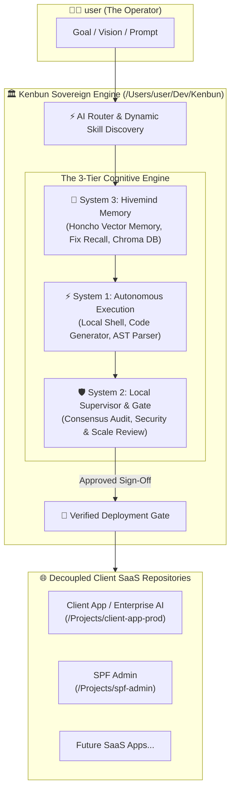
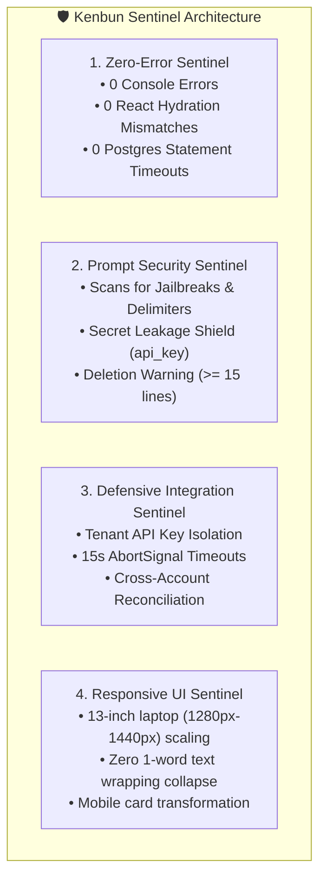

# 🏛️ Kenbun Master Architecture & Operator Mastery Guide
**The Sovereign CTO Operating System: How Kenbun Thinks, Learns, Protects, and Orchestrates**

---

## 🧭 1. What is Kenbun? (The Global Vision)

**Kenbun** is not just an AI coding assistant; it is a **Sovereign CTO Workbench and Cognitive Multi-Agent Engine**. It is designed to act as your autonomous engineering partner to build infinitely scalable, cost-efficient software.



---

## 🧠 2. The 3-System Cognitive Model Explained

Kenbun thinks in three distinct cognitive tiers to prevent the common pitfalls of standard AI chatbots (hallucinations, shallow code, forgotten fixes):

```
+---------------------------------------------------------------------------------------------------+
|  SYSTEM 1: The Executioner (Fast, Tactical Action)                                                |
|  • Writes code, executes terminal commands, runs Next.js builds, compiles TypeScript.            |
|  • Performs regex diffing and AST node transformations.                                           |
+---------------------------------------------------------------------------------------------------+
                                            ⬇
+---------------------------------------------------------------------------------------------------+
|  SYSTEM 2: The Local Supervisor (Auditor & Safety Guardrail)                                      |
|  • "The 5-Persona Advisory Council" (CyberGuard, ScaleMaster, FrugalCFO, PixelArchitect, FutureSelf).|
|  • Multi-model consensus check before code is ever marked complete.                               |
|  • Runs security scans, SQL injection audits, and zero-downtime migration checks.                |
+---------------------------------------------------------------------------------------------------+
                                            ⬇
+---------------------------------------------------------------------------------------------------+
|  SYSTEM 3: The Hivemind (Permanent Memory & Evolution)                                            |
|  • Honcho Long-Term Memory (`recall_fix`, `remember_preference`, `save_to_hivemind`).            |
|  • Chroma DB Semantic Vector Indexing across all project codebases.                              |
|  • Post-Mortem Register: When a bug is solved once, it is permanently remembered forever.       |
+---------------------------------------------------------------------------------------------------+
```

---

## 🧱 3. The Decoupled Workbench Pattern (Why Kenbun is Sacred)

A fundamental rule of Kenbun is **Workbench Decoupling**:

* **Kenbun Core (`/Users/user/Dev/Kenbun`)**: This is the sovereign command center, brain health repository, and skill registry. Client production code is **never mixed directly into Kenbun's core tree**.
* **Isolated Project Directories (`/Users/user/Dev/Projects/<app-name>`)**: Every external client app (e.g. `client-app-prod`, `enterpriseapp.ai`) maintains its own independent Git repository, `package.json`, environment variables, and Docker deployment pipelines.
* **Why this matters:** If a client app breaks, corrupts dependencies, or has breaking Node upgrades, **Kenbun itself remains 100% stable, secure, and unaffected**.

---

## 🛡️ 4. The 4 Kenbun Sentinels & Auto-Healing Mechanics

Kenbun enforces automated pre-flight sentinel gates so you never ship broken code to users:



### 🔧 The Surgical Anchor Self-Healing Engine
When LLMs modify long prompts or large code files, smaller models frequently drop surrounding context (e.g. hallucinating a -136 line deletion). 

**How Kenbun Auto-Heals This:**
1. **Mathematical Set Difference:** Kenbun computes $\text{NewLines} = \text{ProposedLines} \setminus \text{BaselineLines}$.
2. **Anchor Header Search:** Scans the original baseline document for the section header (e.g. `### Personality`).
3. **In-Place Surgical Injection:** Inserts *only* the new directive beneath the header and restores 100% of the original lines, turning a -136 deletion into a clean `+1, -0` patch!

---

## 🔍 5. The Feynman Reversible Cognition Protocol

On every complex task, Kenbun executes the **Feynman Zero-Jargon Protocol**:

1. **Explain to a Dumb Supervisor:** Deeply study the task $\to$ Explain it in plain, simple English with zero jargon.
2. **Freeze Point Detection:** If you stumble, freeze, or rely on vague buzzwords halfway through, that "freeze point" marks the exact epistemic gap or bug.
3. **Raw Source Gap-Fill:** Stop immediately $\to$ Locate the raw line of source code $\to$ Fix the root cause $\to$ Re-explain simply from the beginning until crystal clear.
4. **Dual-Persona Thinking:**
   - **Phase 1 (Developer Mode):** Schema indexing, concurrency limits, type safety.
   - **Phase 2 (End-User Mode):** Ergonomics, visual hierarchy, clarity, white space.

---

## 🚀 6. Operator Command Cheat Sheet (How You Command Kenbun)

| Tool / Command | What It Does | Example Use Case |
|---|---|---|
| `consult_supervisor` | Calls System 2 multi-model auditor to review security and scalability. | Reviewing a database migration or auth route. |
| `autonomous_reflexion` | Queries System 3 memory to recall past mistakes and proven patterns. | Pre-flight check before tackling a complex bug. |
| `save_to_hivemind` / `remember_fix` | Persists a validated solution permanently to Honcho memory. | Locking in a UI theme or Azure firewall rule. |
| `research_official_docs` | Fetches live documentation for any framework (Next.js, Tailwind, FastAPI). | Looking up latest Server Action specs. |
| `bin/pr` | Automated Git branching and Pull Request CLI tool. | `bin/pr start new-feature` $\to$ `bin/pr push` |
| `/goal` | Runs long-running autonomous execution until goal is 100% achieved. | Overnight multi-store scaling tasks. |
| `/schedule` | Sets recurring cron jobs or native timers. | Scheduling iMessage reminders. |

---

## 📈 7. Summary: The Mindset of the Augmented CTO

With Kenbun, you are not writing code line-by-line in isolation. You are acting as the **Augmented CTO**:
* **You direct the vision and architectural invariants.**
* **System 1 executes the code and builds.**
* **System 2 audits and verifies the quality gate.**
* **System 3 permanently remembers the lessons learned.**
